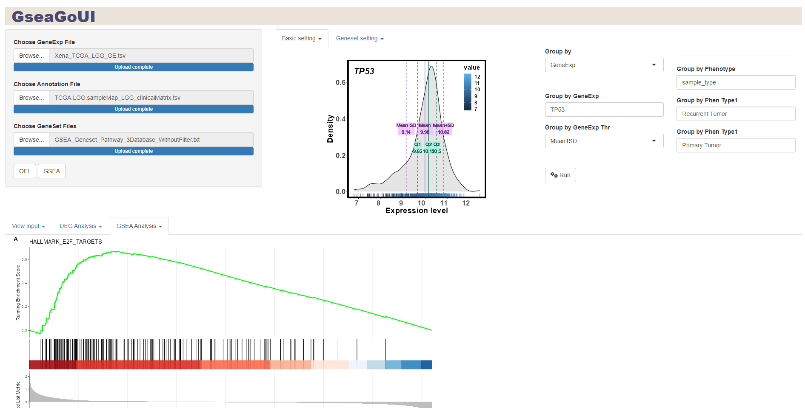

# GseaGoUI 
## A graphical user interface for enrichment analysis.  

## Overview

  Enrichment analysis is widely used in various studies in the medical and biological fields, helping researchers explore the functional profile of the genome of interest in order to better understand the underlying biological processes. However, there are often some problems and challenges when performing enrichment analysis, especially for users who are not familiar with programming. It includes gene name conversion and update, customization of comparison database, analysis results classification and interpretation, etc. The purpose of this study is to establish a user-friendly, accurate, and regularly updated enrichment analysis tool, hoping to help users more easily explore biological mechanisms and biological characteristics. We use TCGA LGG bulk RNA-seq and human single-cell RNA-sequencing PBMC samples to demonstrate enrichment analysis, respectively. The results show the rationality of the analysis and good visualization.
  
  Users can also run GseaGo in R script by installing GseaGo Package( https://github.com/Charlene717/GseaGo )

  
  
  

  
 

