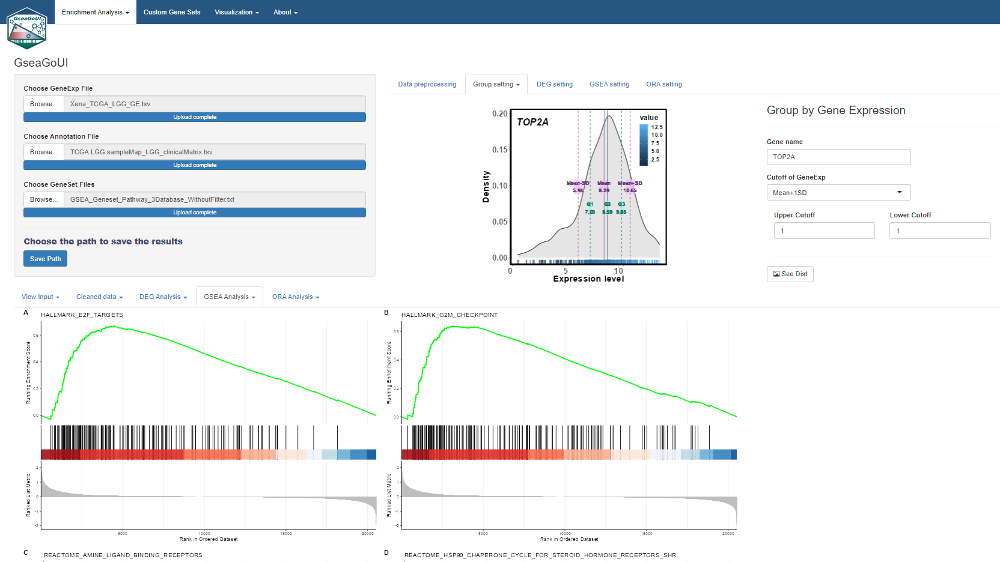

# GseaGoUI
## A R toolkit for enrichment analysis.  
## Overview
GseaGo is a user friendly toolkit for enrichment analysis.
  User can use CellCheck to verify malignancy annotation, cell type annotation, scoring, and deconvolution results from the different conditions. For example, user can compare the performance of different scRNA-seq analysis tools, different improved algorithms, and optimize the parameters used in these tools.
  
  It can also be applied to other use. For example, it can be extended to find biomarkers or gene signatures from databases such as TCGA or other databases.

  
  
  

  
 
